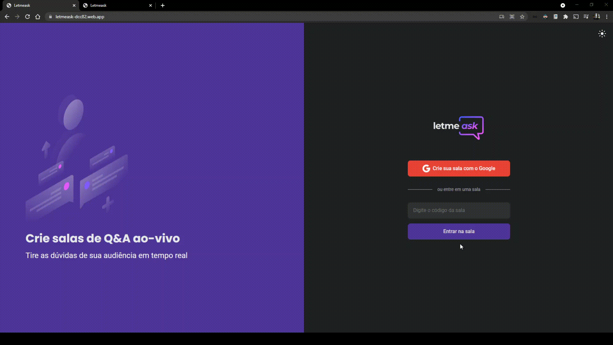

<h1 align='center'>
  
</h1>

<h1>
  
</h1>

<h3 align='center'>
  <a href="https://letmeask-dcc82.web.app/">Acessar a demonstração</a>
</h3>

# Indice
- [Sobre](#-sobre)
- [Milha extra](#-milha-extra)
- [Tecnologias Utilizadas](#-tecnologias-utilizadas)
- [Como baixar o projeto](#-como-baixar-o-projeto)

## 📋 Sobre

O projeto **Letmeask** é uma plataforma de perguntas e respota para livestreams desenvolvido dentro da semana **NLW-Togheter**, da Rockeatseat.

## 💨 Milha extra
#### (Features implementadas depois do NLW-Togheter)

- Modo escuro
- Verificação para entrar em uma sala com administrador

---

## 🚀 Tecnologias utilizadas

O projeto foi desenvolvido utilizado as seguintes tecnologias

- [ReactJS](https://reactjs.org)
- [Firebase](https://firebase.google.com)

---

## 📁 Como baixar o projeto

```bash
  # Clonar o repositório 
  $ git clone https://github.com/pQuintans/NLW-Togheter

  #Entrar no diretório
  $cd NLW-Togheter

  # Instalar as dependências
  $ yarn install

  # Iniciar o projeto
  $ yarn start

```
---
Desenvolvido 🖤 por Pedro Losso Quintans junto com a NLW-Togheter